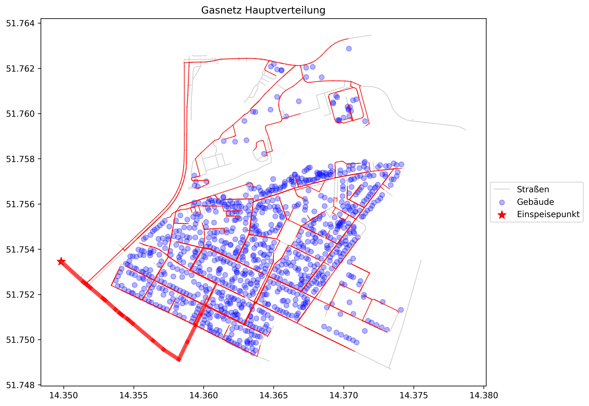
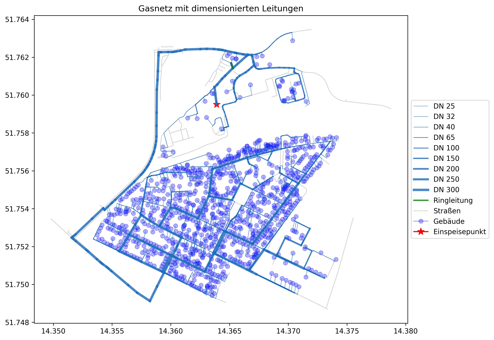

# Gas Distribution Network Analysis and Simulation

This repository contains Python code for analyzing, designing, and simulating a gas distribution network for a given geographic area. The code integrates GIS data, building heating demands, and network modeling to create a comprehensive framework for planning and analyzing gas infrastructure.

## Features

- **Geospatial Data Integration**: Import and process geographic data (OSM, GeoJSON) for streets, buildings, and feeding points.
- **Shortest Path Analysis**: Calculate optimal connection paths for buildings to the main gas network.
- **Network Construction**: Build a comprehensive graph-based representation of the network, including streets and connection points.
- **Hydraulic Simulation**: Use `pandapipes` to model gas flow, pressures, and pipe dimensions.
- **Critical Point Analysis**: Identify critical endpoints and propose ring structures for improved reliability.
- **Visualization**: Generate maps of the network showing pipe diameters, loads, and critical structures.
- **Export for Godot**: Export the network in a format suitable for visualization and interaction in the Godot engine.

## Requirements

To run the code, ensure you have the following Python libraries installed:

- `numpy`
- `pandas`
- `matplotlib`
- `geopandas`
- `shapely`
- `osmnx`
- `networkx`
- `pandapipes`
- `geopy`

You can install the required libraries using pip:

```bash
pip install numpy pandas matplotlib geopandas shapely osmnx networkx pandapipes geopy
```

## Usage

1. **Prepare Input Data**: Ensure the following input files are available:
   - OSM file containing streets and feeding point data (`branitzer_siedlung.osm`).
   - JSON file with building data and coordinates (`output_branitzer_siedlungV11.json`).
   - JSON file with heating demand data (`ergebnis_momentane_heizleistungV3.json`).

2. **Run the Script**:
   Execute the main script to perform all analysis and simulations:
   ```bash
   python main.py
   ```

3. **Outputs**:
   - **Visualizations**:
     - `gasnetz_hauptverteilung.png`: The main gas distribution network.
     - `gasnetz_komplett.png`: The complete network, including ring structures.
   - **Exported Data**:
     - `network_data.json`: Normalized network data for use in Godot.
   - **Simulation Results**:
     - Detailed console outputs of flow velocities, pressures, and pipe dimensions.

## Key Functions

### Data Processing
- `load_and_filter_data`: Load and preprocess street and building data.
- `find_connection_point`: Determine optimal building connection points on streets.

### Network Construction
- `create_street_graph`: Build a graph of streets and connection points.
- `find_shortest_paths`: Calculate shortest paths from the feeding point to buildings.
- `create_main_network`: Aggregate paths to form the main distribution network.

### Hydraulic Simulation
- `create_pandapipes_network`: Generate a `pandapipes` hydraulic model of the network.
- `run_pandapipes_calculation`: Perform flow simulations and calculate network metrics.

### Analysis and Visualization
- `identify_critical_endpoints`: Detect critical points in the network.
- `find_potential_loops`: Propose ring structures to enhance reliability.
- `visualize_dimensioned_network`: Create detailed visualizations of the network.

## Example Output

### Main Network Visualization


### Dimensioned Network Visualization


## Future Work

- Integrate additional GIS layers (e.g., terrain, vegetation) for enhanced planning.
- Extend support for multi-scenario heating demand analysis.
- Optimize the network layout for cost and reliability.

## License

This project is licensed under the MIT License. See the [LICENSE](LICENSE) file for details.

## Contributions

Contributions, issues, and feature requests are welcome! Feel free to fork this repository and submit pull requests.
